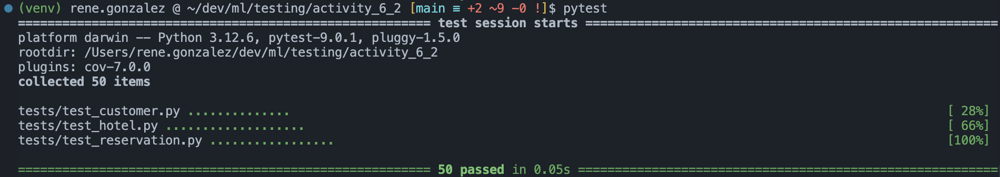
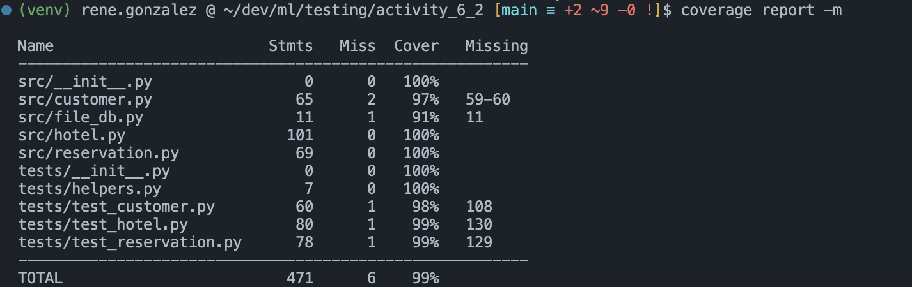
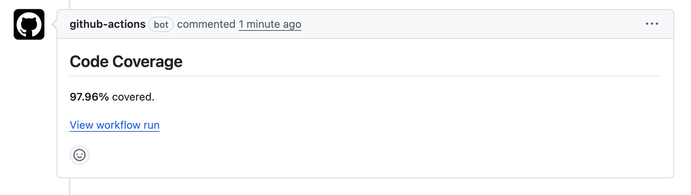
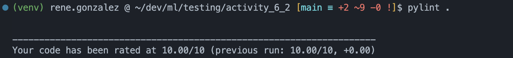
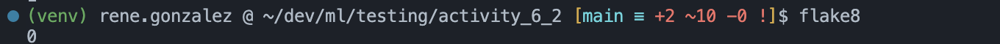

# Activity 6.2 – Hotel Reservation System

Simple hotel reservation system implemented in Python following PEP-8.

[](https://github.com/ReneGV/A01796919-testing-activity-6-2/actions/workflows/coverage.yml)

[](https://github.com/ReneGV/A01796919-testing-activity-6-2/actions/workflows/flake8.yml)

[](https://github.com/ReneGV/A01796919-testing-activity-6-2/actions/workflows/pylint.yml)

[](https://github.com/ReneGV/A01796919-testing-activity-6-2/actions/workflows/pytest.yml)

---

## Setup

### 1. Create the virtual environment
```bash
python3 -m venv venv
```

### 2. Activate it
```bash
source venv/bin/activate   # macOS / Linux
```

### 3. Install dependencies
```bash
pip install -r requirements.txt --index-url https://pypi.org/simple/
```

---

## Running the Tests

```bash
pytest
```



## Code Coverage

```bash
coverage run --source=. -m pytest
coverage report -m
```



Github actions also include a code coverage comment as it can be seen [in this sample PR](https://github.com/ReneGV/A01796919-testing-activity-6-2/pull/1).


## Linting

Both linters are configured via their respective config files and require no extra flags.

### pylint — `.pylintrc`

```bash
pylint .
```


### flake8 — `.flake8`

```bash
flake8 src/ tests/
```

